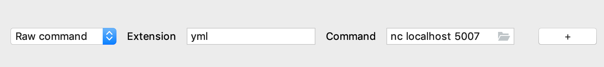
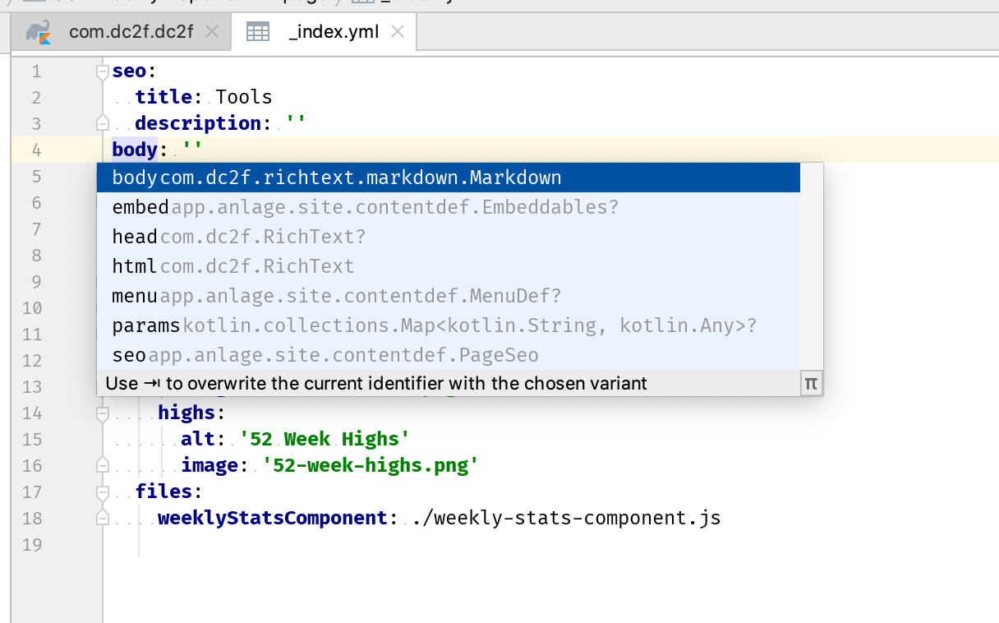
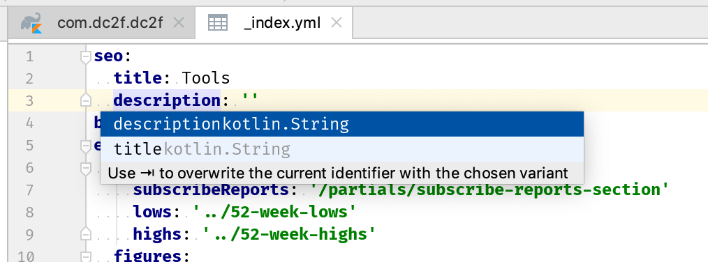

# Content structure auto completion for dc2f yml files

Very simple prototype to provide auto completion and type checking
for yml files used in a [dc2f site](https://github.com/dc2f/dc2f.kt/).

Right now simply use [IntelliJ LSP Plugin](https://github.com/gtache/intellij-lsp) and configure
`.yml` files to use LSP. For example:

## Features

umm.. Not many right now. but we are getting there ;-)

### Autodetect file type and provide auto completion

And this even works for nested types :-)

